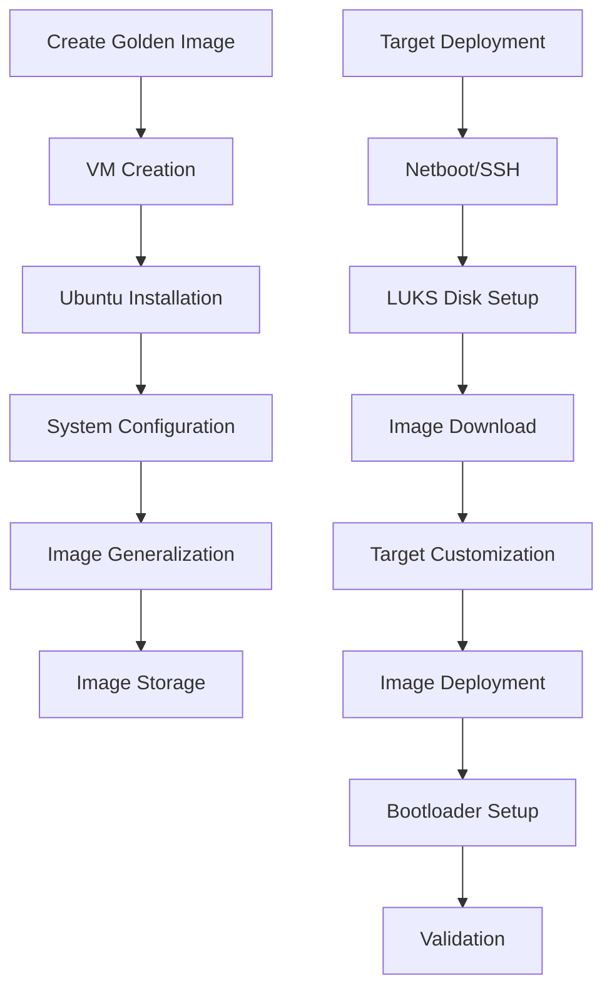

# Ubuntu AutoInstall Agent

<!-- file: README.md -->
<!-- version: 1.0.0 -->
<!-- guid: e5f6g7h8-i9j0-1234-5678-901234efghij -->

A Rust-based automated Ubuntu server deployment system using golden images and full disk encryption.

## Overview

The Ubuntu AutoInstall Agent replaces complex shell-based autoinstall scripts with a reliable, fast golden image deployment system. This tool automates the entire process from image creation to target deployment with LUKS encryption.

### Key Features

- **Golden Image Deployment**: Build once, deploy many times approach
- **Full Disk Encryption**: LUKS encryption by default for security compliance
- **Cross-Architecture Support**: Both amd64 and arm64 architectures
- **Zero-Touch Deployment**: Fully automated with no manual intervention
- **Netboot Ready**: Designed for PXE/netboot bare metal deployments
- **Fast Deployment**: 10x faster than traditional debootstrap methods
- **Robust Error Handling**: Comprehensive logging and error recovery

## Quick Start

### Prerequisites

- Rust 1.70+ installed
- QEMU/KVM for image creation
- Target machines with UEFI boot support
- Network access for downloads and SSH deployment

### Installation

```bash
# Clone the repository
git clone https://github.com/jdfalk/ubuntu-autoinstall-agent.git
cd ubuntu-autoinstall-agent

# Build for your platform
cargo build --release

# Or build for all target architectures
./build-cross-platform.sh
```

### Basic Usage

#### 1. Create a Golden Image

```bash
# Create Ubuntu 24.04 amd64 image
./target/release/ubuntu-autoinstall-agent create-image \
  --arch amd64 \
  --version 24.04 \
  --output ./images/

# Create arm64 image
./target/release/ubuntu-autoinstall-agent create-image \
  --arch arm64 \
  --version 24.04 \
  --output ./images/
```

#### 2. Configure Target Machine

Create a configuration file for your target machine:

```yaml
# config/my-server.yaml
hostname: my-server-001
architecture: amd64
disk_device: /dev/nvme0n1
timezone: America/New_York

network:
  interface: enp0s3
  dhcp: true
  dns_servers:
    - 8.8.8.8
    - 8.8.4.4

users:
  - name: admin
    sudo: true
    ssh_keys:
      - "ssh-ed25519 AAAAC3NzaC1lZDI1NTE5AAAAI..."

luks_config:
  passphrase: "${LUKS_PASSPHRASE}"
  cipher: aes-xts-plain64
  key_size: 512
  hash: sha256

packages:
  - openssh-server
  - htop
  - curl
  - wget
```

#### 3. Deploy to Target

```bash
# Set LUKS passphrase
export LUKS_PASSPHRASE="your-secure-passphrase"

# Deploy via SSH
./target/release/ubuntu-autoinstall-agent deploy \
  --target my-server-001 \
  --config config/my-server.yaml \
  --via-ssh

# Or deploy via netboot/PXE
./target/release/ubuntu-autoinstall-agent deploy \
  --target my-server-001 \
  --config config/my-server.yaml
```

## Architecture

### High-Level Workflow



### System Components

- **Image Builder**: Creates golden Ubuntu images using QEMU/KVM
- **Deployer**: Handles target machine deployment with LUKS encryption
- **Customizer**: Applies target-specific configurations
- **Network Manager**: Handles downloads and SSH operations
- **Security Layer**: LUKS operations and validation
- **Configuration System**: YAML-based configuration management

## Configuration

### Target Configuration

Target configurations define machine-specific settings:

```yaml
hostname: server-name          # Target hostname
architecture: amd64|arm64      # Target architecture
disk_device: /dev/nvme0n1      # Target disk device
timezone: America/New_York     # System timezone

network:
  interface: enp0s3            # Network interface
  dhcp: true                   # Use DHCP or static IP
  ip_address: 192.168.1.100    # Static IP (if dhcp: false)
  gateway: 192.168.1.1         # Network gateway
  dns_servers:                 # DNS servers
    - 8.8.8.8
    - 8.8.4.4

users:                         # User accounts
  - name: username
    sudo: true                 # Sudo access
    shell: /bin/bash           # Default shell
    ssh_keys:                  # SSH public keys
      - "ssh-ed25519 AAAAC3..."

luks_config:                   # Disk encryption
  passphrase: "${LUKS_PASSPHRASE}"
  cipher: aes-xts-plain64
  key_size: 512
  hash: sha256

packages:                      # Additional packages
  - openssh-server
  - htop
  - curl
```

### Image Specifications

Image specs define golden image creation parameters:

```yaml
ubuntu_version: "24.04"        # Ubuntu version
architecture: amd64            # Target architecture

base_packages:                 # Base packages to install
  - openssh-server
  - curl
  - wget
  - htop

vm_config:                     # VM creation settings
  memory_mb: 2048
  disk_size_gb: 20
  cpu_cores: 2

custom_scripts:                # Custom configuration scripts
  - scripts/security-hardening.sh
  - scripts/performance-tuning.sh
```

## Environment Variables

Set these environment variables for secure operation:

```bash
# Required: LUKS encryption passphrase
export LUKS_PASSPHRASE="your-secure-passphrase"

# Optional: Custom image storage location
export IMAGE_STORAGE_PATH="/var/lib/ubuntu-autoinstall/images"

# Optional: SSH private key for deployment
export SSH_PRIVATE_KEY_PATH="/path/to/ssh/key"

# Optional: Enable debug logging
export RUST_LOG=debug
```

## Commands

### `create-image`

Create a golden Ubuntu image:

```bash
ubuntu-autoinstall-agent create-image [OPTIONS]

Options:
  -a, --arch <ARCH>        Target architecture [default: amd64]
  -v, --version <VERSION>  Ubuntu version [default: 24.04]
  -o, --output <OUTPUT>    Output directory [default: ./images]
  -s, --spec <SPEC>        Image specification file
```

### `deploy`

Deploy image to target machine:

```bash
ubuntu-autoinstall-agent deploy [OPTIONS] --target <TARGET> --config <CONFIG>

Options:
  -t, --target <TARGET>    Target hostname or IP
  -c, --config <CONFIG>    Target configuration file
      --via-ssh           Deploy via SSH connection
      --pxe-server <IP>   PXE server for netboot deployment
```

### `validate`

Validate image integrity:

```bash
ubuntu-autoinstall-agent validate --image <IMAGE>

Options:
  -i, --image <IMAGE>      Path to image file
```

### `list-images`

List available images:

```bash
ubuntu-autoinstall-agent list-images
```

### `cleanup`

Clean up old images:

```bash
ubuntu-autoinstall-agent cleanup [OPTIONS]

Options:
      --older-than-days <DAYS>    Delete images older than N days [default: 30]
```

## Deployment Scenarios

### Scenario 1: Development Environment

Quick setup for development machines:

```bash
# Create basic development image
ubuntu-autoinstall-agent create-image --arch amd64 --version 24.04

# Deploy to development machine
ubuntu-autoinstall-agent deploy \
  --target dev-machine \
  --config examples/configs/development.yaml \
  --via-ssh
```

### Scenario 2: Production Cluster

Consistent production deployments:

```bash
# Create production-hardened image
ubuntu-autoinstall-agent create-image \
  --spec examples/specs/production-server.yaml

# Deploy to multiple machines
for host in prod-01 prod-02 prod-03; do
  ubuntu-autoinstall-agent deploy \
    --target $host \
    --config configs/production/$host.yaml
done
```

### Scenario 3: Netboot/PXE Deployment

Bare metal deployment via PXE:

```bash
# Setup PXE server with images
ubuntu-autoinstall-agent create-image --arch amd64
ubuntu-autoinstall-agent create-image --arch arm64

# Deploy via netboot
ubuntu-autoinstall-agent deploy \
  --target netboot \
  --config configs/bare-metal.yaml \
  --pxe-server 192.168.1.1
```

## Security Considerations

### Encryption

- **Full Disk Encryption**: LUKS encryption enabled by default
- **Strong Ciphers**: AES-XTS-256 with SHA-256 hashing
- **Secure Key Management**: Environment variable based passphrases

### Network Security

- **HTTPS Only**: All downloads use HTTPS/TLS
- **SSH Key Authentication**: No password-based SSH access
- **Certificate Validation**: Strict certificate verification

### Operational Security

- **No Credential Logging**: Sensitive data never logged
- **Minimal Privileges**: Operations use least required privileges
- **Input Validation**: All inputs validated before processing

## Troubleshooting

### Common Issues

#### Image Creation Fails

```bash
# Check QEMU/KVM installation
which qemu-system-x86_64
sudo systemctl status libvirtd

# Verify sufficient disk space
df -h /var/lib/ubuntu-autoinstall

# Check logs for details
export RUST_LOG=debug
ubuntu-autoinstall-agent create-image --arch amd64
```

#### Deployment Fails

```bash
# Verify SSH connectivity
ssh user@target-machine

# Check LUKS passphrase
echo $LUKS_PASSPHRASE

# Validate configuration
ubuntu-autoinstall-agent validate --config config/target.yaml
```

#### Performance Issues

```bash
# Monitor resource usage during operations
htop

# Check disk I/O
iotop

# Verify network bandwidth
speedtest-cli
```

### Debug Mode

Enable comprehensive logging:

```bash
export RUST_LOG=debug
ubuntu-autoinstall-agent [command] 2>&1 | tee debug.log
```

## Contributing

See `CONTRIBUTING.md` for development guidelines.

## License

MIT License - see `LICENSE` file for details.

## Support

- **Documentation**: See `docs/` directory
- **Issues**: GitHub Issues
- **Configuration Examples**: `examples/` directory
